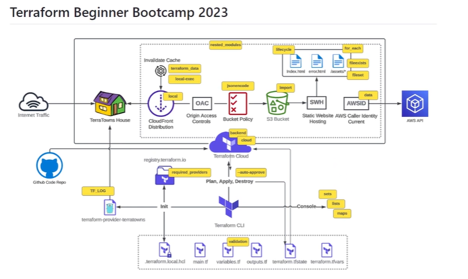

# Terraform Beginner Bootcamp 2023



This project was completed as part of the Terraform Beginner Bootcamp 2023, where all work was conducted over the six weeks of the course. It documents the learning process, challenges faced, and solutions implemented throughout the BootCamp.

## Weekly Journals
- [Week 0 Journal](journal/week0.md)
- [Week 1 Journal](journal/week1.md)

## Extras
- [GitHub Markdown ToC Generator](https://ecotrust-canada.github.io/markdown-toc/)

## Considerations with Terraform CLI Changes 
The Terraform CLI instructions have to change due to gpg keyring changes, so we needed to refer to the latest install CLI instructions via Terraform Documuntation and change the script for install.

[Install Terraform CLI](https://developer.hashicorp.com/terraform/tutorials/aws-get-started/install-cli) 


## Considerations for Linux Distribution
This project is built against ubuntu, please consider checking the Linux distribution and changing for your usecase and needs.

Example of checking OS Version:
```
$ cat /etc/os-release
PRETTY_NAME="Ubuntu 22.04.3 LTS"
NAME="Ubuntu"
VERSION_ID="22.04"
VERSION="22.04.3 LTS (Jammy Jellyfish)"
VERSION_CODENAME=jammy
ID=ubuntu
ID_LIKE=debian
HOME_URL="https://www.ubuntu.com/"
SUPPORT_URL="https://help.ubuntu.com/"
BUG_REPORT_URL="https://bugs.launchpad.net/ubuntu/"
PRIVACY_POLICY_URL="https://www.ubuntu.com/legal/terms-and-policies/privacy-policy"
UBUNTU_CODENAME=jammy
```
[How to check OS Version in Linux](https://www.cyberciti.biz/faq/how-to-check-os-version-in-linux-command-line/)


### Refactoring into Bash Scripts 
While fixing the Terraform CLI gpg depreciation issues, we noticed that the bash script steps had a considerably more code. We therefore decided to create a bash script to install the Terraform CLI.
The bash script is located here: [./bin/install_terraform_cli](./bin/install_terraform_cli)

Using a bin directory is a standard way of conduting business, which is explained in the Lamby Project.

[Lamby Project](https://lamby.cloud/docs/anatomy#architecture)


#### Shebang Considerations 
A Shebang tells the bash script what program will interpret the script. eg. `#!/bin/bash`

Chat GPT recommended this format for bash: `#!/usr/bin/env bash`

- For portability for different OS distributions 
- It will search the user's PATH for the bash executable 

when executing a bash script we can use the `./` shorthand notation to execute the bash script.

[Shebang wiki link](https://en.wikipedia.org/wiki/Shebang_(Unix))


#### Execution Considerations 
e.g. `./bin/install_terraform_cli`
If we are using a script in .gitpod,yaml we need to point the script to a program to interpret it. 

e.g. `source ./bin/install_terraform_cli`


#### Linux Permission Considerations 
In order to make our bash scripts executable we need to change linux permissions for the fix to be executable at the user mode.

```sh
chmod u=x ./bin/install_terraform_cli
```
alternatively 

```sh
chmod 744 ./bin/install_terraform_cli
```
[Chmod wiki link](https://en.wikipedia.org/wiki/Chmod)


## Github Lifecycle (Before, Init, Command)
We need to be careful when using the init because it will not re-run if we restart an existing workspace.

[Gitpod Documentation](https://www.gitpod.io/docs/configure/workspaces/tasks)


## Working Env Vars

### Env Command 

We can list out all enviroment variables (Env Vars) using the `env` command. 

The grep command is a very useful linux command allowing you to filter quickly to specific Env Vars `env | grep AWS_ ` 

#### Setting and Unsetting Env Vars 

In the terminal we can set using `export Hello=world`

in the terminal we can unset using `unset Hello`

We can set an Env Var temporarily when just running a command.

```sh
Hello=`world` ./bin/print_message
```
Within a bash script we can set an Env Var without writing export e.g.

```sh
#!/usr/bin/env bash

Hello=`world`

echo $Hello
```
#### Printing Vars

You can print an Env Var using echo e.g. `echo $Hello`

#### Scoping of Env Vars 
When you open up new bash terminals in VSCode it will not be aware of Env Vars that you have set in another window, if you want Env Vars to persist across all future bash terminals that are open you need to set the Env Vars in your bash profile. e.g. `bash_profile` 

#### Persisting Env Vars in gitpod 

We can persist Env Vars into gitpod by storing them in Gitpod Secrets Storage.

```
gp env Hello=world 
```
All future workspaces launched will set the env vars for all bash terminals opened in those workspaces.

You can also set Env Vars in the `.gitpod.yaml` but this can only contain non-sensitive Env Vars.


## AWS CLI Installation for this project 

AWS CLI is installed for the project via the bash script [`./bin/install_aws_cli`](./bin/install_aws_cli)

[Getting Started Install (AWS CLI)](https://docs.aws.amazon.com/cli/latest/userguide/getting-started-install.html)

[AWS CLI Env Vars](https://docs.aws.amazon.com/cli/latest/userguide/cli-configure-envvars.html)

:warning: Don't install via Homebrew :ambulance::roller_coaster:

:rotating_light: We can check if our AWS credentials are configured correctly by running the following AWS CLI command. 
```sh
aws sts get-caller-id
```
If successful, a json payload should be rerturned that looks like this. 

```JSON
{
    "UserId": "AIDA7RRCITNEJHVPKPEWS",
    "Account": "979354389342",
    "Arn": "arn:aws:iam::199758341882:user/Owen"
}
```

We will need to generate AWS credentials in order to use the AWS CLI.

#### bug magically fixed itself 
>>>>>>> 35148e0 (#7 AWS CLI bash script bug fix, the bug magically fixed itself after a short break.)
